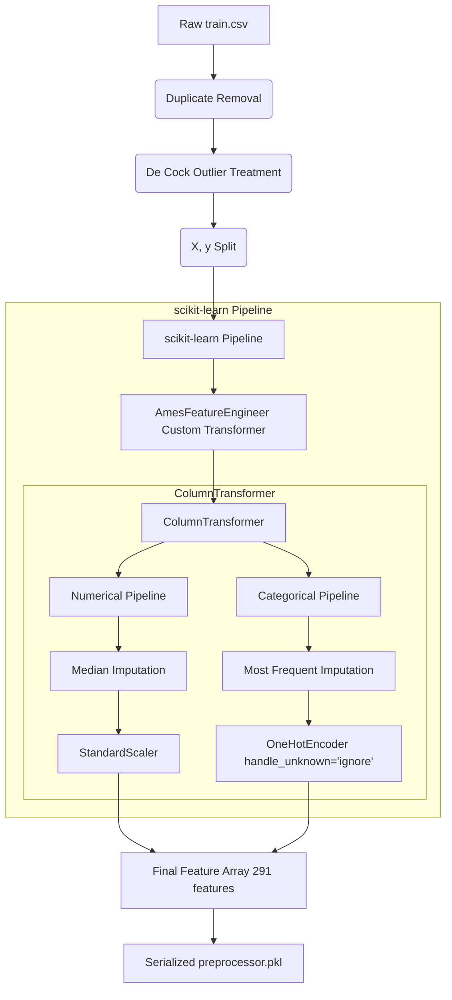

# Ames Housing Preprocessing Pipeline Documentation

This document provides a rigorous, mathematical, and practical explanation of the preprocessing transformations implemented in `backend/ml/src/preprocessing.py`. This pipeline is designed to be fully production-ready, self-contained, and robust against data leakage.

---

## Preprocessing Pipeline Architecture

The preprocessing workflow is split into two phases:
1. **Row-Level Cleaning (Data Ingestion Phase)**: Executed before fitting the pipeline because row-level filtering modifies the record count (which standard scikit-learn pipeline steps cannot do).
2. **Column-Level Preprocessing (Pipeline Phase)**: Implemented as a unified `scikit-learn.pipeline.Pipeline` combining custom feature engineering, missing value imputation, categorical encoding, and numerical scaling.



---

## 1. Row-Level Data Cleaning

### Duplicate Removal
- **Action**: Identified and removed duplicate observations using `df.duplicated()`.
- **Why it improves performance**: Duplicate records artificially inflate model performance evaluation (data leakage if duplicates split between train/test) and skew training coefficients by over-representing specific transactions.

### Outlier Treatment (Ames-Specific Extreme Outliers)
- **Action**: Removed records where `GrLivArea > 4000` sq ft and `SalePrice < $300,000`.
- **Reasoning**: Dean De Cock, the creator of the Ames Housing dataset, explicitly documented that these observations are atypical agricultural properties (such as large farms) that do not represent normal residential market dynamics. 
- **Why it improves performance**: Linear regression, Ridge, Lasso, and Support Vector Regressors are highly sensitive to extreme bivariate leverage points. Fitting on these outliers pulls the regression hyper-plane away from the primary residential distribution, increasing overall mean squared error (MSE) and leading to high residuals on typical homes.

---

## 2. Feature Engineering (`AmesFeatureEngineer`)

The custom transformer engineers 5 powerful composite features directly from the raw inputs:

### A. HouseAge
$$\text{HouseAge} = \text{CurrentYear} - \text{YearBuilt}$$
- **Why it improves performance**: Raw calendar years (e.g. `2003`) are difficult for models to interpret as numerical magnitudes. Converting them to relative ages provides a direct linear relationship: older houses incur physical depreciation, which correlates strongly with lower selling prices.

### B. RemodelAge
$$\text{RemodelAge} = \text{CurrentYear} - \text{YearRemodAdd}$$
- **Why it improves performance**: Houses that were remodeled recently retain high value even if the base build year is old. This represents the time elapsed since the house was updated, which serves as a proxy for modern wear-and-tear and layout relevance.

### C. TotalBathrooms
$$\text{TotalBathrooms} = \text{FullBath} + 0.5 \times \text{HalfBath} + \text{BsmtFullBath} + 0.5 \times \text{BsmtHalfBath}$$
- **Why it improves performance**: Buyers treat bathroom counts cumulatively but distinguish half-baths (lacking shower/tub facilities) and basement baths from full above-grade bathrooms. Consolidating these 4 separate features into a single weighted bathroom index reduces dimensionality, prevents multicollinearity, and acts as a strong linear pricing proxy.

### D. TotalPorchArea
$$\text{TotalPorchArea} = \text{OpenPorchSF} + \text{EnclosedPorch} + \text{3SsnPorch} + \text{ScreenPorch}$$
- **Why it improves performance**: Having multiple small, separate deck and porch metrics increases noise. Summing these areas measures the *total outdoor leisure footprint* of the home, which is a highly valued premium feature in the Ames region.

### E. TotalLivingArea
$$\text{TotalLivingArea} = \text{GrLivArea} + \text{TotalBsmtSF}$$
- **Why it improves performance**: Above-grade living area (`GrLivArea`) and total basement size (`TotalBsmtSF`) are highly correlated with price individually, but they also exhibit strong multicollinearity since larger foundations support larger above-ground spaces. Synthesizing them into a single `TotalLivingArea` feature yields the *true total physical volume* of the house, which explains a massive percentage of target variance while reducing multicollinearity in linear models.

---

## 3. Imputation Strategy (Handling Missing Values)

Real-world deployment demands that missing values be handled gracefully without dropping columns, as doing so would discard predictive signals.

### Numerical Columns: Median Imputation
- **Action**: Imputed missing numerical values with the **Median** of the training partition.
- **Why it improves performance**: Median imputation is robust to outliers, unlike mean imputation which is pulled by heavily skewed features (e.g. `LotArea`, `MasVnrArea`). Utilizing the median guarantees that the center of the column distribution is preserved.

### Categorical Columns: Most Frequent Imputation
- **Action**: Imputed missing categorical values with the **Most Frequent** (Mode) category.
- **Why it improves performance**: Many categorical columns contain high percentages of standard values (e.g., standard electrical systems). Mode imputation fills missing values with the statistically most likely class, maintaining the baseline class balance.

---

## 4. Categorical Encoding & Numerical Scaling

### One-Hot Encoding (`OneHotEncoder`)
- **Action**: Converted all nominal categorical columns into binary columns.
  - Configured with `handle_unknown='ignore'` to output all zeros for unseen categories during production inference, ensuring the model never crashes on novel data.
  - Configured with `sparse_output=False` to produce dense matrices directly compatible with downstream estimators.
- **Why it improves performance**: Machine learning models operate on numerical vectors. One-hot encoding maps non-ordinal categorical values (such as `Neighborhood` or `MSZoning`) into vector dimensions, enabling algorithms to calculate linear weights or split trees on distinct classes.

### Standard Scaling (`StandardScaler`)
- **Action**: Centered and scaled all numerical features (both original and newly engineered):
$$x_{\text{scaled}} = \frac{x - \mu}{\sigma}$$
- **Why it improves performance**: 
  - **Magnitude Bias**: Features have drastically different scales (e.g. `LotArea` in tens of thousands vs `OverallQual` from 1 to 10). Without scaling, distance-based and gradient-descent algorithms (such as Ridge, Lasso, ElasticNet, and KNN) would be dominated by features with larger absolute scales.
  - **Optimization Speed**: Standardizing to $\mu=0$ and $\sigma=1$ shapes the cost function into a well-behaved hypersphere, leading to much faster convergence during gradient descent.

---

## 5. Serializability & Production Readiness

The final output is saved to `backend/ml/models/preprocessor.pkl` using `joblib`. 

### Key Deployment Benefits:
- **Zero Data Leakage**: Fitting is performed strictly on the training partition. The computed medians ($\mu$), standard deviations ($\sigma$), and one-hot categories are baked inside `preprocessor.pkl`.
- **Single Line Inference**: To transform raw data in a web API (e.g. FastAPI / Flask), simply load the preprocessor and run:
  ```python
  raw_df = pd.DataFrame([incoming_json_data])
  transformed_features = preprocessor.transform(raw_df)
  ```
  The custom `AmesFeatureEngineer` will automatically create the 5 engineered features, and the `ColumnTransformer` will impute and scale them identically to training, ensuring total mathematical consistency.
