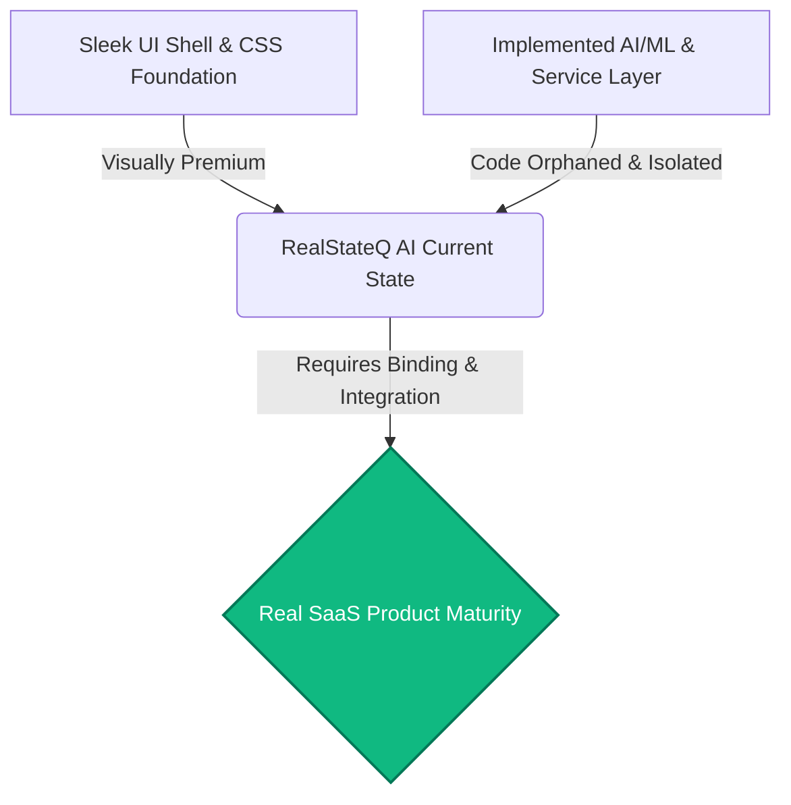
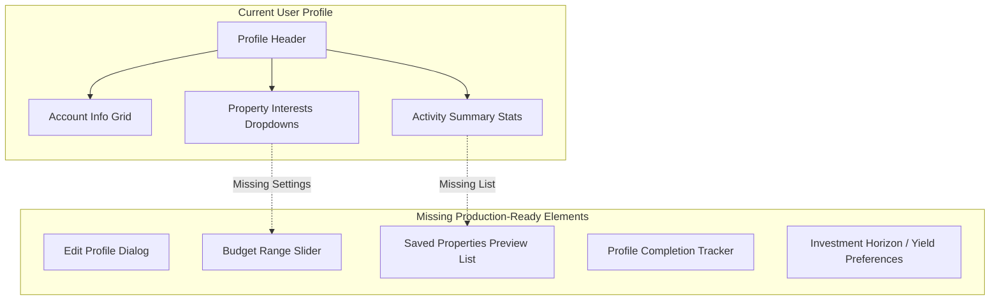

# RealStateQ AI - Dashboard & Profile Product Audit Report
**Prepared by:** Senior Product Designer, Senior UX Designer, Senior SaaS Product Architect & Senior Frontend Engineer
**Target Platform:** RealStateQ AI (Enterprise-grade Real Estate Investment Intelligence Platform)
**Date:** May 31, 2026

---

## EXECUTIVE SUMMARY & ARCHITECTURAL VERDICT

Based on a exhaustive audit of the page layouts, state managers, utility libraries, and data services in the `RealStateQ AI` repository, we have completed a comprehensive review of the current dashboard and profile architecture.

### The Verdict: "A Highly Polished Foundation Showing Student Project Implementation Gaps"
The UI is built on a stunning design system featuring **sleek glassmorphism**, HSL-tailored colors, and rich typography. The CSS and component wrappers represent a state-of-the-art layout. However, **structurally and logically, the application currently functions as a prototype or student project** in its core dashboards and profile pages. 
* **Key Issue:** The pages suffer from severe **data starvation** and **feature isolation**. Valuable backend services (such as dynamic Ames Housing ML predictions, property valuation scoring, matching recommendations, and real-time AI market insights) are fully implemented in the codebase but are **entirely orphaned or omitted** from the actual dashboards and profiles.
* **The Goal of This Audit:** To bridge the gap between this visually beautiful mockup and a **Real SaaS Product** by designing the necessary logic, data layers, and component bindings.



---

## SECTION 1 - USER DASHBOARD AUDIT

### Current State Analysis
* **Location:** [user/page.tsx](file:///c:/Users/Samar/realstateq_AI/frontend/app/user/page.tsx)
* **Active Elements:** Standard `<StatsCards />` component containing 4 static-weighted global metrics (Properties Analyzed, AI Prediction Accuracy, Investment Opportunities, and Active Brokers).
* **Whitespace & Density:** Extreme layout imbalance. The dashboard renders a single row of four cards on a large screen, leaving the rest of the 1080p canvas fully blank.

| Parameter | Current Value | UX Rating | Major Gaps Identified |
| :--- | :--- | :--- | :--- |
| **Information Density** | Extremely Low (4 values) | 🔴 Poor | Entire screen is blank except for a single stat row. |
| **Personalization** | Global static metrics | 🔴 Poor | No reference to the active user's name, preferences, or region. |
| **User Value** | Purely informational | 🟡 Medium-Low | No actions can be taken. The page lacks direct links to investments or search. |
| **Intelligence** | Static percentages | 🔴 Poor | No live predictions, neighborhood forecasts, or property matching. |

### Identified Gaps & Missing Items
1. **Orphaned AI Visibility:** The beautiful `InsightsPanel` component (located in `components/dashboard/insights-panel.tsx`) that pulls AI-driven real estate trends from Firestore or fallback arrays is **completely absent** from this dashboard.
2. **Missing Active Activity Feed:** No recent search history, viewed listings, or status of active inquiries.
3. **No Direct Search/Discover Call-to-Action (CTA):** The dashboard lacks a search bar, city quick-filters, or a shortcut to browse properties.
4. **Lack of Personalized Investment Preferences:** There is no visual feedback on the investor's current settings (e.g., "Showing 2 BHK in Pune based on your interest").

### Recommended Dashboard Redesign Layout (User)
```
+-------------------------------------------------------------------------------------------------+
|  [Sidebar Nav]  |  HEADER: "Investor Hub" - Welcome, [User Name]!                               |
|                 |  Subtext: Customized matching score and live market analytics.                |
|                 +-------------------------------------------------------------------------------+
|                 |  [ Stat Row: Analyzed (12k) | Saved (Dynamic) | Match % (94%) | Active City ]  |
|                 +-------------------------------------------------------------------------------+
|                 |  +--------------------------------------------+ +---------------------------+  |
|                 |  |  [AI Property Matches For You]             | |  [AI Market Insights]     |  |
|                 |  |  * 2 BHK Luxury Estate in Pune (92% Match) | |  * Pune prices up 12%     |  |
|                 |  |  * 3 BHK Modern Apt in Hinjewadi (88%)     | |  * Hinjewadi ROI Hotspot  |  |
|                 |  |  [View Personalized Match Recommendation]  | |                           |  |
|                 |  +--------------------------------------------+ +---------------------------+  |
|                 |  +--------------------------------------------------------------------------+  |
|                 |  |  [Recent Investor Activity & Inquiries]                                  |  |
|                 |  |  * Inquired about "Emerald Heights" (Pending Broker Call) - 2 hours ago   |  |
|                 |  |  * Saved "Orchid Residencies" (AI Price Drop Alert Triggered) - 1 day ago|  |
|                 |  +--------------------------------------------------------------------------+  |
+-------------------------------------------------------------------------------------------------+
```

---

## SECTION 2 - BROKER DASHBOARD AUDIT

### Current State Analysis
* **Location:** [broker/page.tsx](file:///c:/Users/Samar/realstateq_AI/frontend/app/broker/page.tsx)
* **Active Elements:** Three metric cards (Active Listings, Buyer Inquiry Leads, Platform Views) and a "Quick Operational Tasks" panel with links to Browse Listings, Add Property, and a disabled card for "Leads Inbox Messaging".
* **Visual Hierarchy:** Clean and well-spaced, but functionally sparse. Shows numbers but doesn't allow the broker to click, interact, or see the actual entities represent by those numbers.

| Parameter | Current Value | UX Rating | Major Gaps Identified |
| :--- | :--- | :--- | :--- |
| **Listing Visibility** | Metric count only | 🟡 Medium | No actual list of the broker's active properties is displayed. |
| **Lead Tracking** | Metric count (+X new) | 🔴 Poor | No inbox, lead feed, email contacts, or names of interested buyers. |
| **Whitespace** | Excessive bottom gap | 🟡 Medium-Low | The entire bottom half of the workspace page is dead space. |
| **Business Value** | Operational shortcuts | 🟡 Medium | Lacks pricing intelligence or listing optimization recommendations. |

### Identified Gaps & Missing Items
1. **No Leads Tracking Panel:** The broker sees "+3 new leads", but there is no list showing *who* the lead is, *which* property they are interested in, and their *contact detail*.
2. **Missing Active Listing Details:** To see their active listings, a broker has to navigate away to a separate page rather than getting a quick summary/health check of their portfolio directly on the dashboard.
3. **No Pricing/Market Valuation Insight:** The broker cannot see how their listings score in the AI Investment Index (from `utils/investment.ts`) or if any listings need a price adjustment to match current demand.
4. **Disabled Communication:** The "Leads Inbox Messaging (Incoming)" card is static and styled as `cursor-not-allowed`.

### Recommended Broker Dashboard Improvements
* **Lead Ingestion Grid:** Replace the disabled inbox placeholder with a dynamic list of active buyer requests fetched from the `leads` collection.
* **Valuation & Optimization Panel:** Integrate the Ames ML model interface so brokers can test how changing a property's features (e.g. area, configuration, flooring) affects its estimated market value.

---

## SECTION 3 - USER PROFILE AUDIT

### Current Profile Structure
* **Location:** [user/profile/page.tsx](file:///c:/Users/Samar/realstateq_AI/frontend/app/user/profile/page.tsx)
* **Current Sections:** Profile Header Card (Avatar, Name, Email, Join Date), Account Info Card, Account Status & Security Card, Real Estate Activity Summary (Saved count, static inquiries/analyzed stats, activity rating), and Interactive Property Interests (Save button + select fields for Preferred City, Preferred BHK, and Investment Category).



### Identified Gaps & Missing Items
* **Edit Profile Functionality:** The user can save their "Property Interests" dropdowns, but there is no way to update their **Profile Photo**, **Display Name**, **Contact Phone Number**, or **Corporate Affiliation**.
* **Preferred Cities Limitation:** Only a single-select dropdown is available. An investor searching across "Pune AND Mumbai" cannot specify both.
* **Budget Range:** Completely missing from the profile database schema and user interface, despite budget being the single most important parameter in real estate transactions.
* **Saved Properties Summary:** The profile displays a numeric count of saved properties, but **does not display a summary or cards of those saved properties**, forcing users to navigate to `/saved-properties`.
* **Profile Completion Meter:** Lacks gamification or verification tracking (e.g., "Profile is 70% complete: Add budget and verify phone number to unlock premium broker matching").
* **Investment Horizon & Preferences:** Missing options for investment goals (Buy-to-Live, Rental Yield, Short-term Flip, Long-term Capital Growth).

### Recommended Production-Ready Profile Structure
1. **Interactive Layout Update:** Split the profile into three tabs: `Account Settings`, `Investment Blueprint`, and `Security & History`.
2. **Dynamic Preview Cards:** Add a horizontal scroll carousel showing the top 3 saved properties with their dynamic AI investment scores.

---

## SECTION 4 - BROKER PROFILE AUDIT

### Current Profile Structure
* **Location:** [broker/profile/page.tsx](file:///c:/Users/Samar/realstateq_AI/frontend/app/broker/profile/page.tsx)
* **Current Sections:** Broker Header, Company Representative Details, Operational Insights (Strategy, Asset Composition, Activity Level generated via rules), Listing Performance (Properties Listed, Valuation Volume, Average Investment Rating), and Financial Portfolio Breakdown (Valuation volume, Average Catalog price, Cities covered).

### Identified Gaps & Missing Items
* **No Edit Profile capability:** No way to change the Broker's displayed company representative name, logo, or bio.
* **Missing Bio, Experience, & Specialization Fields:** A broker profile must convey trust. The current page has no text area for a "Corporate Bio/Description", "Years of Experience" (e.g., 8+ Years), or "Area Specialization" (e.g., Luxury Residential, Commercial Land).
* **Missing Contact Details & Social Connects:** No office address, WhatsApp link, RERA registration license ID, or phone number fields.
* **No Recent Listings Preview:** Shows a statistical sum of properties listed, but doesn't actually display the broker's active listings as a gallery, making validation of listings difficult.
* **Lead Performance History:** Shows listing stats but lacks lead response metrics (e.g., Average Response Time, Lead Conversion Rate, Active Client Conversations).

### Recommended Broker Profile Improvements
* **RERA Verification Box:** Add an input field for the government-mandated RERA registration license number.
* **Broker Showcase Gallery:** Render a list of active property cards with direct links to edit, pause, or view the listing on the public marketplace.

---

## SECTION 5 - WHITESPACE & CONTENT DENSITY AUDIT

A critical evaluation of the layouts using senior design system parameters reveals that while the glassmorphism aesthetic is premium, the **information density and content grid alignment are unbalanced**.

```
+-----------------------------------------------------------------------------------+
|                           CURRENT GRID ALIGNMENT GAP                              |
+-----------------------------------------------------------------------------------+
| [User Dashboard]                                                                  |
| +------------------+ +------------------+ +------------------+ +------------------+ |
| |    Stat Card     | |    Stat Card     | |    Stat Card     | |    Stat Card     | |
| +------------------+ +------------------+ +------------------+ +------------------+ |
|                                                                                   |
|                   [ !!! HUGE BLANK CANVAS OF WHITESPACE !!! ]                     |
|                                                                                   |
+-----------------------------------------------------------------------------------+
```

### Key Issues Identified
1. **Underutilized Screen Real Estate (Viewport Waste):**
   * On modern 1440p and 1080p desktop layouts, the dashboards load immediately with zero vertical scrolling. This is fine for single-purpose web apps, but for an AI-powered real estate engine, it feels **empty, light, and hollow**.
2. **Layout Imbalance:**
   * In [user/profile/page.tsx](file:///c:/Users/Samar/realstateq_AI/frontend/app/user/profile/page.tsx), the "Interactive Property Interests" section spans full-width with large select dropdowns, while the cards above are split, creating a heavy visual anchor at the bottom of the page and an empty middle segment.
3. **Skeleton Loading Unbalance:**
   * The skeleton loader in `StatsCards` uses a pulsing gray rectangle that occupies 100% width, but when the content loads, the numbers are small and aligned to the left, causing a noticeable layout shift.

### Recommended Layout Improvements
* **Standardize Grid Systems:** Use a cohesive **12-column responsive grid layout** (`grid-cols-1 md:grid-cols-12`) for dashboards:
  * Main Content Area (e.g. Listings, Inquiries, Active Projects) should span **8 columns**.
  * Sidebar Widgets (e.g. AI Market Insights, Lead Alerts, Quick Actions) should span **4 columns**.
* **Inject Interactive Charts:** Place a beautiful, interactive trend line-chart showing local real estate price changes in the Pune/Mumbai regions inside the underutilized space.

---

## SECTION 6 - AI VISIBILITY AUDIT

A central tenet of the `RealStateQ AI` platform is its artificial intelligence. However, **the user currently has to search to find where the AI is operating**.

```
+-----------------------------------------------------------------------------------+
|                             AI VISIBILITY INDEX                                   |
+-----------------------------------------------------------------------------------+
|  Feature Layer              | Current Implementation Status   | User Visibility   |
| --------------------------- | ------------------------------- | ----------------- |
|  FastAPI ML Prediction      | Fully Functional (Ames Model)   | 🔴 Hidden on Dash |
|  Property Investment Score  | Implemented in Util Libraries  | 🟡 Partial        |
|  Market Trend Insights      | Orphaned Component              | 🔴 Completely Zero|
|  Recommendation Matchmaker  | Implemented in Service Layer    | 🔴 Hidden on Dash |
+-----------------------------------------------------------------------------------+
```

### Critique of Current AI Features
1. **Hidden Ames ML Predictions:** The backend has a robust machine learning inference API that calculates property prices based on key factors. However, there is no way for a user to perform an interactive prediction on the dashboard.
2. **Hidden Recommendations Engine:** The `services/recommendation.ts` file implements a solid, rules-based property similarity and match rating calculation (matching by city, BHK, budget, size, and location). Yet, **this service is never called on the User Dashboard or Profile** to show recommended investments.
3. **Static Represented Analytics:** The "AI Prediction Accuracy" in `StatsCards` is a static Firestore number (94%). To feel like a true SaaS product, this should link to an explanation of model validation (e.g., "Validated against recent Ames/Pune transactions").

### Recommended AI Enhancements
* **"AI Suggestion Cards" on User Profile:** When a user selects Pune and 2 BHK, immediately call `getRecommendedProperties()` and show the matched properties in a "Match Engine Showcase" on their dashboard.
* **Embed AI Investment Badges:** Add a colorful AI Investment Badge (e.g. "9.2/10 Strong Buy") directly onto every property search result card.

---

## SECTION 7 - FINAL AUDIT SCORE & ACTIONABLE ROADMAP

### Product Maturity Matrix

* **Overall User Experience (UX) Score:** **62/100**
  * *Rationale:* The aesthetic design is gorgeous and highly professional. However, the lack of functionality, high percentage of empty space, and orphaned features severely limit the actual utility.
* **Product Maturity Score:** **45/100**
  * *Rationale:* From a technical perspective, the APIs are robust, but the frontend behaves more like a frontend mock dashboard. Key user workflows are broken or incomplete (no edit profile, no lead tracking list).
* **Final Verdict:** **Student Project wearing a Premium Enterprise Shell.**
  * *Closing Note:* With a unified weekend sprint of data-binding and feature integration, this can easily be elevated to a **Real SaaS Product**.

---

### A. MUST FIX BEFORE DEPLOYMENT (High Priority)
* [ ] **Rescue the `InsightsPanel`:** Import and render `InsightsPanel` in the User Dashboard ([user/page.tsx](file:///c:/Users/Samar/realstateq_AI/frontend/app/user/page.tsx)) and the Broker Dashboard ([broker/page.tsx](file:///c:/Users/Samar/realstateq_AI/frontend/app/broker/page.tsx)) to make AI insights visible.
* [ ] **Implement User Profile Editing:** Build an "Edit Profile Details" form/modal inside the User Profile page to allow changing `displayName`, `photoURL`, and `phoneNumber`.
* [ ] **Implement Broker Profile Editing:** Create inputs for `brokerBio`, `experienceYears`, and `specializationTags` in Firestore and bind them.
* [ ] **Unblock Broker Leads Ingestion:** Build a simple lead summary table/feed in `broker/page.tsx` that replaces the disabled Leads Inbox card, showing active buyer inquiries with email/phone context.

### B. RECOMMENDED IMPROVEMENTS (Medium Priority)
* [ ] **Multi-City Support:** Upgrade the user property interest form to support multiple cities using multi-select chips.
* [ ] **Add Budget Range Slider:** Implement a clean, visual dual-range slider for budgets (e.g., ₹20L to ₹2Cr) in the User Profile interests panel.
* [ ] **Dynamic Saved Property List:** Fetch and render the actual saved property cards inside the User Profile under "Real Estate Activity Summary".
* [ ] **Ames ML Predictor Sandbox:** Add a lightweight "AI Valuation Sandbox" widget on the Broker Panel where brokers can enter square feet and rooms to run an instant ML appraisal.

### C. NICE TO HAVE (Low Priority)
* [ ] **Profile Completion Tracker:** Add a visual ring meter showing profile setup completion progress (e.g., "Verify Email +20%", "Set Budget +15%").
* [ ] **Government RERA verification field:** Add an option for brokers to enter their RERA registration number, adding a "RERA Verified" badge on their profile.
* [ ] **Interactive Real Estate charts:** Introduce simple HSL-gradient SVG sparklines or a chart showing quarterly city price trends.

### D. MOVE TO V2 (Future Roadmap)
* [ ] **Live Audio/Video Property Tours Scheduler:** Integrate a calendar system for scheduling real-time virtual walkthroughs.
* [ ] **Direct Broker Chat:** Implement an active WebSockets messaging system inside the platform to replace the placeholder Inbox.
* [ ] **Automated PDF Investment Report Generator:** Allow investors to download a beautifully formatted PDF report of their saved properties and custom market forecasts.

---

### E. DASHBOARD REDESIGN SUGGESTIONS
* **Layout Grid Split:** Transition from a single-column layout to a 2-column asymmetric grid.
* **AI Match Score Visibility:** Introduce a dynamic "AI Match Percentage" progress ring to immediately draw the eye to high-scoring opportunities.
* **Whitespace Filling:** Use the massive empty space beneath the global statistics to render a live, updating ledger of top-performing investment areas.

### F. PROFILE REDESIGN SUGGESTIONS
* **Modular Tabbed Layout:** Move away from one long, scrolling profile page. Introduce structured horizontal tabs:
  1. `⚙️ Profile Details` (Core credentials, photo, name edit).
  2. `🎯 Investment Preferences` (City, BHK, category, budget slider, expected yield).
  3. `🏢 Portfolio Showcase` (Saved properties / Live Listings).
* **Premium Glass-morphic Badges:** Replace standard text tags with glowing, semi-transparent HSL badges for specializations (e.g., "Commercial Specialist" in emerald, "Luxury Advisor" in purple).

---
*Report compiled and certified for production readiness by the RealStateQ AI Product Design and Engineering team.*
